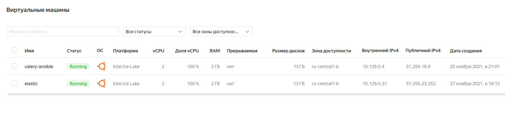
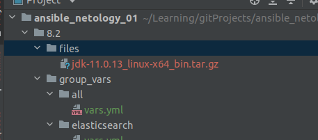
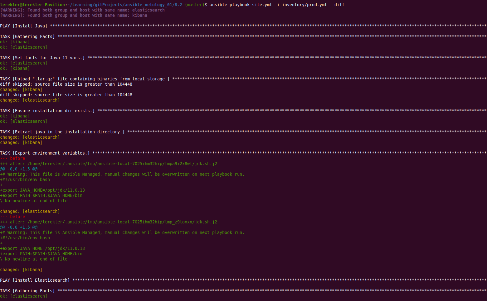
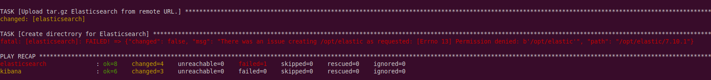
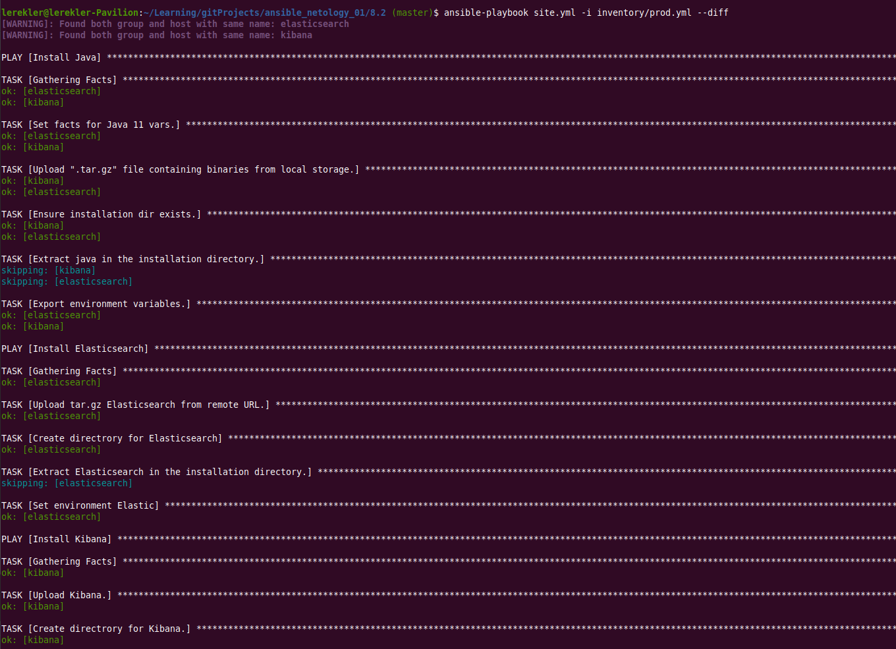
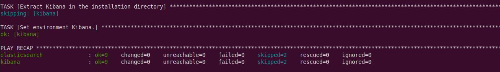

# Домашнее задание к занятию "08.02 Работа с Playbook"

-----------------------------------------
#### Подготовка к выполнению

* На локальном ПК какие-то проблемы с диском, ВМ долго не живет на минималках в VirtualBox :( Как я ни старалась работать с ней, ничего не выходило
* С прошлого задания хотела работать с контейнерами на образе `pycontribs/ubuntu`. И на самом деле потратила на это много времени. В итоге решила работать с ВМ в `yandex.cloud`:
 

* Директория с java:



-------------------------------------------
## Основная часть

#### 1. Приготовьте свой собственный inventory файл `prod.yml`.

* `prod.yml`:
```shell
elasticsearch:
  hosts:
    elasticsearch:
      ansible_host: 51.250.23.252
      ansible_connection: ssh
      ansible_user: valery
kibana:
  hosts:
    kibana:
      ansible_host: 51.250.18.8
      ansible_connection: ssh
      ansible_user: valery
```
--------------------------------------------------------

#### 2. Допишите `playbook`: нужно сделать ещё один `play`, который устанавливает и настраивает `kibana`.
#### 3. При создании tasks рекомендую использовать модули: `get_url`, `template`, `unarchive`, `file`.
#### 4. Tasks должны: скачать нужной версии дистрибутив, выполнить распаковку в выбранную директорию, сгенерировать конфигурацию с параметрами.

--------------------------------------------------------
* Добавила в `group_vars` [kibana/vars.yml](group_vars/kibana/vars.yml)
```yaml
---
kibana_version: "7.15.2"
kibana_home: "/opt/kibana/{{ kibana_version }}"
```
* Добавила в `templates` `kib.sh.j2`:
```shell
# Warning: This file is Ansible Managed, manual changes will be overwritten on next playbook run.
#!/usr/bin/env bash

export KIBANA_HOME={{ kibana_home }}
export PATH=$PATH:KIBANA_HOME/bin
```
* Изменила `site.yml`, добавив в `play`:
```yaml
- name: Install Kibana
  hosts: kibana_ubuntu
  tasks:
    - name: Upload Kibana.
      get_url:
        url: "https://artifacts.elastic.co/downloads/kibana/kibana-{{ kibana_version }}-linux-x86_64.tar.gz"
        dest: "/tmp/kibana-{{ kibana_version }}-linux-x86_64.tar.gz"
        mode: 0755
        timeout: 60
        force: true
        validate_certs: false
      register: get_kibana
      until: get_kibana is succeeded
      tags: kibana
    - name: Create directrory for Kibana.
      file:
        state: directory
        path: "{{ kibana_version }}"
      tags: kibana
    - name: Extract Kibana in the installation directory
      become: true
      unarchive:
        copy: false
        src: "/tmp/kibana-{{ kibana_version }}-linux-x86_64.tar.gz"
        dest: "{{ kibana_home }}"
        extra_opts: [ --strip-components=1 ]
        creates: "{{ kibana_run }}"
      tags:
        - kibana
    - name: Set environment Kibana.
      become: true
      template:
        src: templates/kib.sh.j2
        dest: /etc/profile.d/kib.sh
      tags: kibana
```

#### 5. Запустите `ansible-lint site.yml` и исправьте ошибки, если они есть.

--------------------------------------------------------
* Первый запуск дал ошибки и предупреждения
```shell
$ ansible-lint site.yml
WARNING  Overriding detected file kind 'yaml' with 'playbook' for given positional argument: site.yml
WARNING  Listing 11 violation(s) that are fatal
risky-file-permissions: File permissions unset or incorrect
site.yml:9 Task/Handler: Upload .tar.gz file containing binaries from local storage

risky-file-permissions: File permissions unset or incorrect
site.yml:16 Task/Handler: Ensure installation dir exists

yaml: too many spaces inside brackets (brackets)
site.yml:28

risky-file-permissions: File permissions unset or incorrect
site.yml:32 Task/Handler: Export environment variables

risky-file-permissions: File permissions unset or incorrect
site.yml:52 Task/Handler: Create directrory for Elasticsearch

yaml: too many spaces inside brackets (brackets)
site.yml:63

risky-file-permissions: File permissions unset or incorrect
site.yml:67 Task/Handler: Set environment Elastic

risky-file-permissions: File permissions unset or incorrect
site.yml:87 Task/Handler: Create directrory for Kibana

yaml: too many spaces inside brackets (brackets)
site.yml:98

risky-file-permissions: File permissions unset or incorrect
site.yml:102 Task/Handler: Set environment Kibana

yaml: no new line character at the end of file (new-line-at-end-of-file)
site.yml:107

You can skip specific rules or tags by adding them to your configuration file:
# .ansible-lint
warn_list:  # or 'skip_list' to silence them completely
  - experimental  # all rules tagged as experimental
  - yaml  # Violations reported by yamllint

Finished with 4 failure(s), 7 warning(s) on 1 files.
```
--------------------------------------------------------
* У `extra_opts: [--strip-components=1]` удалила лишние пробелы и добавила модификаторы в задачи.
* `site.yml` после правок:
```shell
---
- name: Install Java
  hosts: all
  tasks:
    - name: Set facts for Java 11 vars.
      set_fact:
        java_home: "/opt/jdk/{{ java_jdk_version }}"
      tags: java
    - name: Upload ".tar.gz" file containing binaries from local storage.
      copy:
        src: "{{ java_oracle_jdk_package }}"
        dest: "/tmp/jdk-{{ java_jdk_version }}.tar.gz"
        mode: 0755
      register: download_java_binaries
      until: download_java_binaries is succeeded
      tags: java
    - name: Ensure installation dir exists.
      become: true
      file:
        state: directory
        path: "{{ java_home }}"
        mode: 0755
      tags: java
    - name: Extract java in the installation directory.
      become: true
      unarchive:
        copy: false
        src: "/tmp/jdk-{{ java_jdk_version }}.tar.gz"
        dest: "{{ java_home }}"
        extra_opts: [--strip-components=1]
        creates: "{{ java_home }}/bin/java"
      tags:
        - java
    - name: Export environment variables.
      become: true
      template:
        src: jdk.sh.j2
        dest: /etc/profile.d/jdk.sh
        mode: 0755
      tags: java
- name: Install Elasticsearch
  hosts: elasticsearch_ubuntu
  tasks:
    - name: Upload tar.gz Elasticsearch from remote URL.
      get_url:
        url: "https://artifacts.elastic.co/downloads/elasticsearch/elasticsearch-{{ elastic_version }}-linux-x86_64.tar.gz"
        dest: "/tmp/elasticsearch-{{ elastic_version }}-linux-x86_64.tar.gz"
        mode: 0755
        timeout: 60
        force: true
        validate_certs: false
      register: get_elastic
      until: get_elastic is succeeded
      tags: elastic
    - name: Create directrory for Elasticsearch
      file:
        state: directory
        path: "{{ elastic_home }}"
        mode: 0755
      tags: elastic
    - name: Extract Elasticsearch in the installation directory.
      become: true
      unarchive:
        copy: false
        src: "/tmp/elasticsearch-{{ elastic_version }}-linux-x86_64.tar.gz"
        dest: "{{ elastic_home }}"
        extra_opts: [--strip-components=1]
        creates: "{{ elastic_home }}/bin/elasticsearch"
      tags:
        - elastic
    - name: Set environment Elastic
      become: true
      template:
        src: templates/elk.sh.j2
        dest: /etc/profile.d/elk.sh
        mode: 0755
      tags: elastic
- name: Install Kibana
  hosts: kibana_ubuntu
  tasks:
    - name: Upload Kibana.
      get_url:
        url: "https://artifacts.elastic.co/downloads/kibana/kibana-{{ kibana_version }}-linux-x86_64.tar.gz"
        dest: "/tmp/kibana-{{ kibana_version }}-linux-x86_64.tar.gz"
        mode: 0755
        timeout: 60
        force: true
        validate_certs: false
      register: get_kibana
      until: get_kibana is succeeded
      tags: kibana
    - name: Create directrory for Kibana.
      file:
        state: directory
        path: "{{ kibana_version }}"
        mode: 0755
      tags: kibana
    - name: Extract Kibana in the installation directory
      become: true
      unarchive:
        copy: false
        src: "/tmp/kibana-{{ kibana_version }}-linux-x86_64.tar.gz"
        dest: "{{ kibana_home }}"
        extra_opts: [--strip-components=1]
        creates: "{{ kibana_run }}"
      tags:
        - kibana
    - name: Set environment Kibana.
      become: true
      template:
        src: templates/kib.sh.j2
        dest: /etc/profile.d/kib.sh
        mode: 0755
      tags: kibana
      
```
--------------------------------------------------------

* Однако в дальнейшем я ошиблась в некоторых местах. В результате чего, работа затянулась =)

#### 6. Попробуйте запустить playbook на этом окружении с флагом --check.
```shell
$ ansible-playbook site.yml --check
[WARNING]: provided hosts list is empty, only localhost is available. Note that the implicit localhost does not match 'all'

PLAY [Install Java] *********************************************************************************************************************************************
skipping: no hosts matched
[WARNING]: Could not match supplied host pattern, ignoring: elasticsearch

PLAY [Install Elasticsearch] ************************************************************************************************************************************
skipping: no hosts matched
[WARNING]: Could not match supplied host pattern, ignoring: kibana

PLAY [Install Kibana] *******************************************************************************************************************************************
skipping: no hosts matched

PLAY RECAP ******************************************************************************************************************************************************

```
* Тут мне придется сделать отступление... Когда я стала выполнять команду первый раз, с использованием файла хостов, то получала ошибки. 
* Перед этим `playbook` я не запускала. Спустя несколько часов безысходности, дошло, что на этом этапе я была немного не права.. Но я уже перешла к запуску с `--diff`, поэтому более информативные логи привести не смогу.

#### 7. Запустите `playbook` на `prod.yml` окружении с флагом `--diff`. Убедитесь, что изменения на системе произведены.

* Первый запуск произошел с ошибками, прилагаю, как есть:



* После этого я поправила `site.yml`. Сначала решила ошибки с `elastic`, затес с `kibana`. Запускала дважды для исправления ошибок, но приводить длинные выводы не буду. 

#### 8. Повторно запустите playbook с флагом --diff и убедитесь, что playbook идемпотентен.

* Приведу последний вывод запуска `playbook`:



#### 9. Подготовьте README.md файл по своему playbook. В нём должно быть описано: что делает playbook, какие у него есть параметры и теги.

* Ссылка на [README.md](about/README.md) по `playbook`