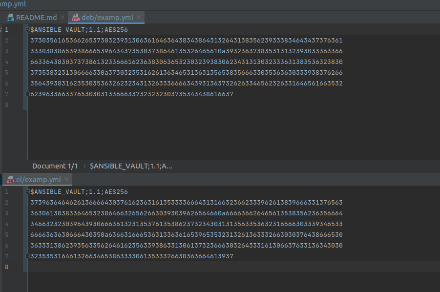

# Домашнее задание к занятию "08.01 Введение в Ansible"

## Ansible

```shell
$ ansible --version
ansible [core 2.11.6] 
  config file = /etc/ansible/ansible.cfg
  configured module search path = ['/home/lerekler/.ansible/plugins/modules', '/usr/share/ansible/plugins/modules']
  ansible python module location = /usr/lib/python3/dist-packages/ansible
  ansible collection location = /home/lerekler/.ansible/collections:/usr/share/ansible/collections
  executable location = /usr/bin/ansible
  python version = 3.8.10 (default, Sep 28 2021, 16:10:42) [GCC 9.3.0]
  jinja version = 2.10.1
  libyaml = True
```
--------------------------------------------------------------------------
### Самоконтроль выполнения задания

1. Где расположен файл с some_fact из второго пункта задания?
   > Файл `group_vars/all/examp.yml` 
2. Какая команда нужна для запуска вашего playbook на окружении test.yml?
   > ansible-playbook site.yml -i inventory/test.yml
3. Какой командой можно зашифровать файл?
   > ansible-vault encrypt
4. Какой командой можно расшифровать файл?
   > ansible-vault decrypt
5. Можно ли посмотреть содержимое зашифрованного файла без команды расшифровки файла? Если можно, то как?
   > ansible-vault view или ansible-vault edit
6. Как выглядит команда запуска playbook, если переменные зашифрованы?
   > Должны добавить --ask-vault-pass
   > ansible-playbook site.yml -i inventory/prod.yml  --ask-vault-pass
7. Как называется модуль подключения к host на windows?
   > winrm модуль
8. Приведите полный текст команды для поиска информации в документации ansible для модуля подключений ssh
   > $ ansible-doc -t connection plugin ssh
9. Какой параметр из модуля подключения ssh необходим для того, чтобы определить пользователя, под которым необходимо совершать подключение?
   > '- remote_user'


--------------------------------------------------------------------------
## Обязательная часть

#### 1. Попробуйте запустить playbook на окружении из `test.yml`, зафиксируйте какое значение имеет факт `some_fact` для указанного хоста при выполнении `playbook'a`.

```shell
$ ansible-playbook site.yml -i inventory/test.yml

PLAY [Print os facts] **************************************************************************************************************************************************************************************************************

TASK [Gathering Facts] *************************************************************************************************************************************************************************************************************
ok: [localhost]

TASK [Print OS] ********************************************************************************************************************************************************************************************************************
ok: [localhost] => {
    "msg": "Ubuntu"
}

TASK [Print fact] ******************************************************************************************************************************************************************************************************************
ok: [localhost] => {
    "msg": 12
}

PLAY RECAP *************************************************************************************************************************************************************************************************************************
localhost                  : ok=3    changed=0    unreachable=0    failed=0    skipped=0    rescued=0    ignored=0  
```

---------------------------------------------------
* **some_fact 12**
---------------------------------------------------

#### 2. Найдите файл с переменными (group_vars) в котором задаётся найденное в первом пункте значение и поменяйте его на 'all default fact'.

* Файл `group_vars/all/examp.yml` 

#### 3. Воспользуйтесь подготовленным (используется docker) или создайте собственное окружение для проведения дальнейших испытаний.

* Развернула контейнеры:
```shell
$ docker pull ubuntu:latest
latest: Pulling from library/ubuntu
7b1a6ab2e44d: Pull complete 
Digest: sha256:626ffe58f6e7566e00254b638eb7e0f3b11d4da9675088f4781a50ae288f3322
Status: Downloaded newer image for ubuntu:latest
docker.io/library/ubuntu:latest
$ docker volume create --name ansvolume_01
ansvolume_01
$ docker run --name ansible_ubuntu -v ansvolume_01:/home/lerekler/Learning/gitProjects/ansvolume_01 -dti ubuntu:latest 
bf393632650bae96bcb69a4eb472e4523e9ad265326052218290cbd92c263f52
#############
############# образ centos:7 уже был загружен
#############
$ docker volume create --name ansvolume_02
ansvolume_02
$ docker run --name ansible_centos -v ansvolume_02:/home/lerekler/Learning/gitProjects/ansvolume_02 -dti centos:7
5d29faaa57e0e96f9fdda6961bc400ac1ff63d085dbe62c081417a00cd65bb9e
$ docker ps
CONTAINER ID   IMAGE           COMMAND       CREATED          STATUS          PORTS     NAMES
5d29faaa57e0   centos:7        "/bin/bash"   4 seconds ago    Up 3 seconds              ansible_centos
bf393632650b   ubuntu:latest   "bash"        24 minutes ago   Up 24 minutes             ansible_ubuntu

$ docker exec -dti ansible_ubuntu sleep 500000000
$ docker exec -dti ansible_centos sleep 500000000
```
* `prod.yml` заменен на соответствующие наименования контейнеров
```yaml
---
  el:
    hosts:
      ansible_centos:
        ansible_connection: docker
  deb:
    hosts:
      ansible_ubuntu:
        ansible_connection: docker
```

#### 4. Проведите запуск playbook на окружении из prod.yml. Зафиксируйте полученные значения some_fact для каждого из managed host.
```shell
$ ansible-playbook site.yml -i inventory/prod.yml 

PLAY [Print os facts] *********************************************************************************************************************************************************************************************************************

TASK [Gathering Facts] ********************************************************************************************************************************************************************************************************************
ok: [ansible_ubuntu]
ok: [ansible_centos]

TASK [Print OS] ***************************************************************************************************************************************************************************************************************************
ok: [ansible_centos] => {
    "msg": "CentOS"
}
ok: [ansible_ubuntu] => {
    "msg": "Ubuntu"
}

TASK [Print fact] *************************************************************************************************************************************************************************************************************************
ok: [ansible_centos] => {
    "msg": "el"
}
ok: [ansible_ubuntu] => {
    "msg": "deb"
}

PLAY RECAP ********************************************************************************************************************************************************************************************************************************
ansible_centos             : ok=3    changed=0    unreachable=0    failed=0    skipped=0    rescued=0    ignored=0   
ansible_ubuntu             : ok=3    changed=0    unreachable=0    failed=0    skipped=0    rescued=0    ignored=0  
```

* Для `centos` `some_facts`=**"el"**
* Для `ubuntu` `some_facts`=**"deb"**

#### 5. Добавьте факты в `group_vars` каждой из групп хостов так, чтобы для `some_fact` получились следующие значения: для `deb - 'deb default fact'`, для `el - 'el default fact'`.

* `deb/examp.yml`:
```yaml
---
  some_fact: "deb default fact"
```
* `el/examp.yml`:
```yaml
---
  some_fact: "el default fact"
```

#### 6. Повторите запуск `playbook` на окружении `prod.yml`. Убедитесь, что выдаются корректные значения для всех хостов.

```shell
$ ansible-playbook site.yml -i inventory/prod.yml 

PLAY [Print os facts] *********************************************************************************************************************************************************************************************************************

TASK [Gathering Facts] ********************************************************************************************************************************************************************************************************************
ok: [ansible_ubuntu]
ok: [ansible_centos]

TASK [Print OS] ***************************************************************************************************************************************************************************************************************************
ok: [ansible_centos] => {
    "msg": "CentOS"
}
ok: [ansible_ubuntu] => {
    "msg": "Ubuntu"
}

TASK [Print fact] *************************************************************************************************************************************************************************************************************************
ok: [ansible_centos] => {
    "msg": "el default fact"
}
ok: [ansible_ubuntu] => {
    "msg": "deb default fact"
}

PLAY RECAP ********************************************************************************************************************************************************************************************************************************
ansible_centos             : ok=3    changed=0    unreachable=0    failed=0    skipped=0    rescued=0    ignored=0   
ansible_ubuntu             : ok=3    changed=0    unreachable=0    failed=0    skipped=0    rescued=0    ignored=0   
```

#### 7. При помощи `ansible-vault` зашифруйте факты в `group_vars/deb` и `group_vars/el` с паролем netology.

```shell
$ ansible-vault encrypt group_vars/deb/examp.yml 
New Vault password: 
Confirm New Vault password: 
Encryption successful
$ ansible-vault encrypt group_vars/el/examp.yml 
New Vault password: 
Confirm New Vault password: 
Encryption successful

```


```shell
$ ansible-playbook site.yml -i inventory/prod.yml 

PLAY [Print os facts] *********************************************************************************************************************************************************************************************************************
ERROR! Attempting to decrypt but no vault secrets found

```
#### 8. Запустите `playbook` на окружении `prod.yml`. При запуске ansible должен запросить у вас пароль. Убедитесь в работоспособности.

```shell
$ ansible-playbook site.yml -i inventory/prod.yml  --ask-vault-pass
Vault password: 

PLAY [Print os facts] *********************************************************************************************************************************************************************************************************************

TASK [Gathering Facts] ********************************************************************************************************************************************************************************************************************
ok: [ansible_ubuntu]
ok: [ansible_centos]

TASK [Print OS] ***************************************************************************************************************************************************************************************************************************
ok: [ansible_centos] => {
    "msg": "CentOS"
}
ok: [ansible_ubuntu] => {
    "msg": "Ubuntu"
}

TASK [Print fact] *************************************************************************************************************************************************************************************************************************
ok: [ansible_centos] => {
    "msg": "el default fact"
}
ok: [ansible_ubuntu] => {
    "msg": "deb default fact"
}

PLAY RECAP ********************************************************************************************************************************************************************************************************************************
ansible_centos             : ok=3    changed=0    unreachable=0    failed=0    skipped=0    rescued=0    ignored=0   
ansible_ubuntu             : ok=3    changed=0    unreachable=0    failed=0    skipped=0    rescued=0    ignored=0   
```

#### 9. Посмотрите при помощи `ansible-doc` список плагинов для подключения. Выберите подходящий для работы на `control node`.
```shell
$ ansible-doc -t connection -l
[WARNING]: Collection ibm.qradar does not support Ansible version 2.11.6
[WARNING]: Collection frr.frr does not support Ansible version 2.11.6
[WARNING]: Collection splunk.es does not support Ansible version 2.11.6
ansible.netcommon.httpapi      Use httpapi to run command on network appliances                                                                                                                                     
ansible.netcommon.libssh       (Tech preview) Run tasks using libssh for ssh connection                                                                                                                             
ansible.netcommon.napalm       Provides persistent connection using NAPALM                                                                                                                                          
ansible.netcommon.netconf      Provides a persistent connection using the netconf protocol                                                                                                                          
ansible.netcommon.network_cli  Use network_cli to run command on network appliances                                                                                                                                 
ansible.netcommon.persistent   Use a persistent unix socket for connection                                                                                                                                          
community.aws.aws_ssm          execute via AWS Systems Manager                                                                                                                                                      
community.docker.docker        Run tasks in docker containers                                                                                                                                                       
community.docker.docker_api    Run tasks in docker containers                                                                                                                                                       
community.docker.nsenter       execute on host running controller container                                                                                                                                         
community.general.chroot       Interact with local chroot                                                                                                                                                           
community.general.funcd        Use funcd to connect to target                                                                                                                                                       
community.general.iocage       Run tasks in iocage jails                                                                                                                                                            
community.general.jail         Run tasks in jails                                                                                                                                                                   
community.general.lxc          Run tasks in lxc containers via lxc python library                                                                                                                                   
community.general.lxd          Run tasks in lxc containers via lxc CLI                                                                                                                                              
community.general.qubes        Interact with an existing QubesOS AppVM                                                                                                                                              
community.general.saltstack    Allow ansible to piggyback on salt minions                                                                                                                                           
community.general.zone         Run tasks in a zone instance                                                                                                                                                         
community.kubernetes.kubectl   Execute tasks in pods running on Kubernetes                                                                                                                                          
community.libvirt.libvirt_lxc  Run tasks in lxc containers via libvirt                                                                                                                                              
community.libvirt.libvirt_qemu Run tasks on libvirt/qemu virtual machines                                                                                                                                           
community.okd.oc               Execute tasks in pods running on OpenShift                                                                                                                                           
community.vmware.vmware_tools  Execute tasks inside a VM via VMware Tools                                                                                                                                           
containers.podman.buildah      Interact with an existing buildah container                                                                                                                                          
containers.podman.podman       Interact with an existing podman container                                                                                                                                           
kubernetes.core.kubectl        Execute tasks in pods running on Kubernetes                                                                                                                                          
local                          execute on controller                                                                                                                                                                
paramiko_ssh                   Run tasks via python ssh (paramiko)                                                                                                                                                  
psrp                           Run tasks over Microsoft PowerShell Remoting Protocol                                                                                                                                
ssh                            connect via ssh client binary                                                                                                                                                        
winrm                          Run tasks over Microsoft's WinRM                   
```

#### 10. В `prod.yml` добавьте новую группу хостов с именем `local`, в ней разместите `localhost` с необходимым типом подключения.

```yaml
---
  el:
    hosts:
      ansible_centos:
        ansible_connection: docker
  deb:
    hosts:
      ansible_ubuntu:
        ansible_connection: docker
  local:
    hosts:
      example:
        ansible_host: localhost
        ansible_connection: local
```

#### 11. Запустите playbook на окружении `prod.yml`. При запуске ansible должен запросить у вас пароль. Убедитесь что факты `some_fact` для каждого из хостов определены из верных `group_vars`.

```shell
$ ansible-playbook site.yml -i inventory/prod.yml  --ask-vault-pass
Vault password: 

PLAY [Print os facts] *********************************************************************************************************************************************************************************************************************

TASK [Gathering Facts] ********************************************************************************************************************************************************************************************************************
ok: [example]
ok: [ansible_ubuntu]
ok: [ansible_centos]

TASK [Print OS] ***************************************************************************************************************************************************************************************************************************
ok: [example] => {
    "msg": "Ubuntu" ## у меня ubuntu
}
ok: [ansible_centos] => {
    "msg": "CentOS"
}
ok: [ansible_ubuntu] => {
    "msg": "Ubuntu"
}

TASK [Print fact] *************************************************************************************************************************************************************************************************************************
ok: [example] => {
    "msg": "all default fact"
}
ok: [ansible_centos] => {
    "msg": "el default fact"
}
ok: [ansible_ubuntu] => {
    "msg": "deb default fact"
}

PLAY RECAP ********************************************************************************************************************************************************************************************************************************
ansible_centos             : ok=3    changed=0    unreachable=0    failed=0    skipped=0    rescued=0    ignored=0   
ansible_ubuntu             : ok=3    changed=0    unreachable=0    failed=0    skipped=0    rescued=0    ignored=0   
example                    : ok=3    changed=0    unreachable=0    failed=0    skipped=0    rescued=0    ignored=0   
```
----------------------------------------------------

## Необязательная часть

#### 1. При помощи `ansible-vault` расшифруйте все зашифрованные файлы с переменными.
```shell
$ ansible-vault decrypt group_vars/deb/examp.yml 
Vault password: 
Decryption successful
$ ansible-vault decrypt group_vars/el/examp.yml 
Vault password: 
Decryption successful
```

#### 2. Зашифруйте отдельное значение `PaSSw0rd` для переменной `some_fact` паролем `netology`. Добавьте полученное значение в `group_vars/all/exmp.yml`.
```shell
$ ansible-vault encrypt_string 'PaSSw0rd' --name 'some_fact'
New Vault password: 
Confirm New Vault password: 
some_fact: !vault |
          $ANSIBLE_VAULT;1.1;AES256
          61646362313366646535313338663434653239313336613232363035383639616335636263326461
          6638366136323233373630626164333132363631396634390a303666613866663331353734393865
          33373130373534353062613762653061613563373935653233393230356633616635656531393238
          3030646363633139340a636132363832396139646266353135633630663965646465386664323266
          3462
Encryption successful
```

#### 3. Запустите playbook, убедитесь, что для нужных хостов применился новый fact.
* Запуск `playbook`:
```shell
$ ansible-playbook site.yml -i inventory/prod.yml  --ask-vault-pass
Vault password: 

PLAY [Print os facts] *********************************************************************************************************************************************************************************************************************

TASK [Gathering Facts] ********************************************************************************************************************************************************************************************************************
ok: [example]
ok: [ansible_ubuntu]
ok: [ansible_centos]

TASK [Print OS] ***************************************************************************************************************************************************************************************************************************
ok: [example] => {
    "msg": "Ubuntu"
}
ok: [ansible_centos] => {
    "msg": "CentOS"
}
ok: [ansible_ubuntu] => {
    "msg": "Ubuntu"
}

TASK [Print fact] *************************************************************************************************************************************************************************************************************************
ok: [example] => {
    "msg": "PaSSw0rd"
}
ok: [ansible_centos] => {
    "msg": "el default fact"
}
ok: [ansible_ubuntu] => {
    "msg": "deb default fact"
}

PLAY RECAP ********************************************************************************************************************************************************************************************************************************
ansible_centos             : ok=3    changed=0    unreachable=0    failed=0    skipped=0    rescued=0    ignored=0   
ansible_ubuntu             : ok=3    changed=0    unreachable=0    failed=0    skipped=0    rescued=0    ignored=0   
example                    : ok=3    changed=0    unreachable=0    failed=0    skipped=0    rescued=0    ignored=0   
```

#### 4. Добавьте новую группу хостов fedora, самостоятельно придумайте для неё переменную. В качестве образа можно использовать этот.

```shell
$ docker ps
CONTAINER ID   IMAGE                      COMMAND       CREATED          STATUS          PORTS     NAMES
a96599e24e66   pycontribs/fedora:latest   "/bin/bash"   17 minutes ago   Up 17 minutes             ansible_fedora
22e3233d36e4   ubuntu:latest              "bash"        2 hours ago      Up 2 hours                ansible_ubuntu
5b48ca05a5c7   centos:7                   "/bin/bash"   2 hours ago      Up 2 hours                ansible_centos
```
* Переменная:
```shell
$ cd group_vars/fed/
$ cat examp.yml 
---
  var_test: "fedora variable"
```
* `site.yml`:
```yaml
---
  - name: Print os facts
    hosts: all
    tasks:
      - name: Print OS
        debug:
          msg: "{{ ansible_distribution }}"
      - name: Print fact
        debug:
          msg: "{{ some_fact }}"
        when: (ansible_facts['distribution'] != "Fedora")
      - name: Print fact
        debug:
          msg: "{{ var_test }}"
        when: (ansible_facts['distribution'] == "Fedora")
```
* Запуск `playbook'a`:
```shell
$ ansible-playbook site.yml -i inventory/prod.yml  --ask-vault-pass
Vault password: 

PLAY [Print os facts] *********************************************************************************************************************************************************************************************************************

TASK [Gathering Facts] ********************************************************************************************************************************************************************************************************************
ok: [example]
ok: [ansible_ubuntu]
ok: [ansible_fedora]
ok: [ansible_centos]

TASK [Print OS] ***************************************************************************************************************************************************************************************************************************
ok: [example] => {
    "msg": "Ubuntu"
}
ok: [ansible_centos] => {
    "msg": "CentOS"
}
ok: [ansible_ubuntu] => {
    "msg": "Ubuntu"
}
ok: [ansible_fedora] => {
    "msg": "Fedora"
}

TASK [Print fact] *************************************************************************************************************************************************************************************************************************
ok: [example] => {
    "msg": "PaSSw0rd"
}
skipping: [ansible_fedora]
ok: [ansible_centos] => {
    "msg": "el default fact"
}
ok: [ansible_ubuntu] => {
    "msg": "deb default fact"
}

TASK [Print fact] *************************************************************************************************************************************************************************************************************************
skipping: [ansible_centos]
skipping: [ansible_ubuntu]
skipping: [example]
ok: [ansible_fedora] => {
    "msg": "fedora variable"
}

PLAY RECAP ********************************************************************************************************************************************************************************************************************************
ansible_centos             : ok=3    changed=0    unreachable=0    failed=0    skipped=1    rescued=0    ignored=0   
ansible_fedora             : ok=3    changed=0    unreachable=0    failed=0    skipped=1    rescued=0    ignored=0   
ansible_ubuntu             : ok=3    changed=0    unreachable=0    failed=0    skipped=1    rescued=0    ignored=0   
example                    : ok=3    changed=0    unreachable=0    failed=0    skipped=1    rescued=0    ignored=0   

```

#### 5. Напишите скрипт на bash: автоматизируйте поднятие необходимых контейнеров, запуск ansible-playbook и остановку контейнеров.

* Скрипт: [start_ansible](start_ansible.sh)

```shell
$ ./start_ansible.sh 
image: pycontribs/ubuntu
container: ubuntu
Using default tag: latest
Status: Downloaded newer image for pycontribs/ubuntu:latest
docker.io/pycontribs/ubuntu:latest
873266df60c3753650c67831fa6b73bcfcc628b26a2e7e522226d468e2807b2a
image: pycontribs/centos
container: centos
7: Pulling from pycontribs/centos
Status: Downloaded newer image for pycontribs/centos:7
docker.io/pycontribs/centos:7
0bae3d126c799cb3cfd832e35023e3978bbbb6d603ab53071c316f110f221cc8
image: pycontribs/fedora
container: fedora
Using default tag: latest
Status: Downloaded newer image for pycontribs/fedora:latest
docker.io/pycontribs/fedora:latest
aef75afc0905040220a019025469bc740ae390e2ac055741bc19fbdddd15ef7a
Vault password: 

PLAY [Print os facts] *********************************************************************************************************************************************************************************************************************

TASK [Gathering Facts] ********************************************************************************************************************************************************************************************************************
ok: [example]
ok: [fedora]
[DEPRECATION WARNING]: Distribution Ubuntu 18.04 on host ubuntu should use /usr/bin/python3, but is using /usr/bin/python for backward compatibility with prior Ansible releases. A future Ansible release will default to using the 
discovered platform python for this host. See https://docs.ansible.com/ansible-core/2.11/reference_appendices/interpreter_discovery.html for more information. This feature will be removed in version 2.12. Deprecation warnings can be 
disabled by setting deprecation_warnings=False in ansible.cfg.
ok: [ubuntu]
ok: [centos]

TASK [Print OS] ***************************************************************************************************************************************************************************************************************************
ok: [example] => {
    "msg": "Ubuntu"
}
ok: [centos] => {
    "msg": "CentOS"
}
ok: [ubuntu] => {
    "msg": "Ubuntu"
}
ok: [fedora] => {
    "msg": "Fedora"
}

TASK [Print fact] *************************************************************************************************************************************************************************************************************************
skipping: [fedora]
ok: [example] => {
    "msg": "PaSSw0rd"
}
ok: [centos] => {
    "msg": "el default fact"
}
ok: [ubuntu] => {
    "msg": "deb default fact"
}

TASK [Print fact] *************************************************************************************************************************************************************************************************************************
skipping: [centos]
skipping: [ubuntu]
skipping: [example]
ok: [fedora] => {
    "msg": "fedora variable"
}

PLAY RECAP ********************************************************************************************************************************************************************************************************************************
centos                     : ok=3    changed=0    unreachable=0    failed=0    skipped=1    rescued=0    ignored=0   
example                    : ok=3    changed=0    unreachable=0    failed=0    skipped=1    rescued=0    ignored=0   
fedora                     : ok=3    changed=0    unreachable=0    failed=0    skipped=1    rescued=0    ignored=0   
ubuntu                     : ok=3    changed=0    unreachable=0    failed=0    skipped=1    rescued=0    ignored=0   

container for image pycontribs/ubuntu stopping....
873266df60c3
container stopped
container for image pycontribs/centos stopping....
0bae3d126c79
container stopped
container for image pycontribs/fedora stopping....
aef75afc0905
container stopped

```